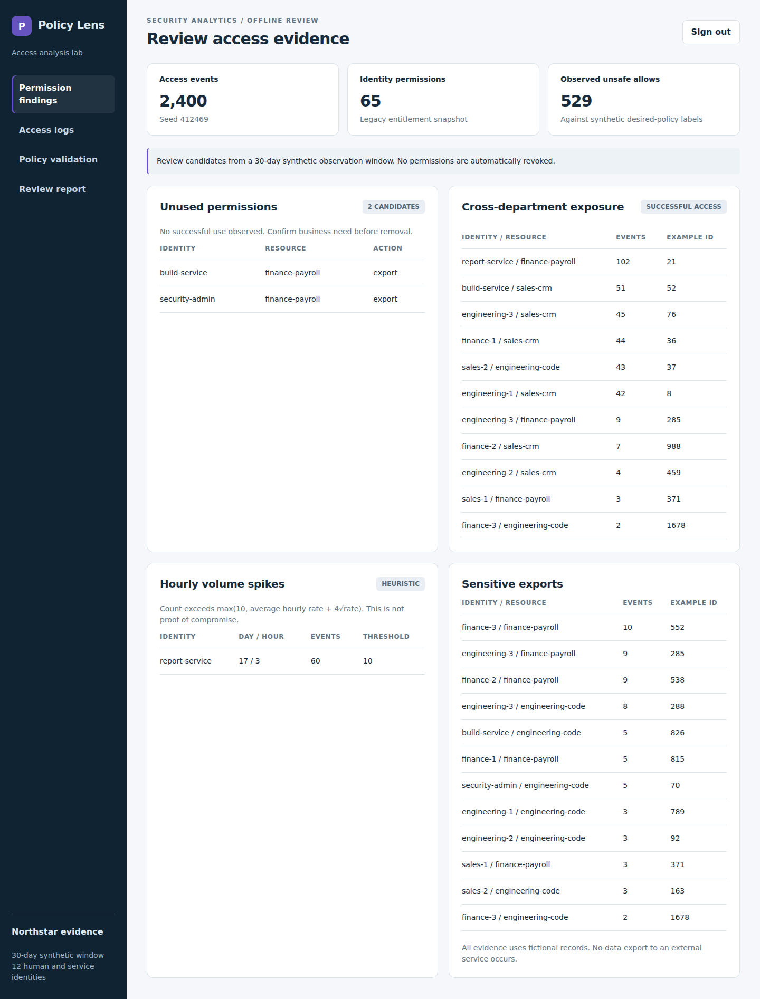

# Policy Lens — Access Policy Analysis and Validation Lab

Analyze access logs, review permission usage, and measure the consequences of
proposed access policies. This project complements implementation of IAM controls
by focusing on **evidence, SQL analysis, and policy validation**.



## Run

Requires **Python 3.10+**. No packages, API keys, Docker, or paid services.

```bash
python3 app.py
```

Open http://127.0.0.1:8767 and sign in as **admin / DemoPass!2026**.
Windows: `py app.py`. The server binds only to localhost; stop with Ctrl+C.
This login protects the analyst workspace; the project does not grant employee
access, enforce policies on a real service, or change live permissions.

## What it does

- Queries 2,400 seeded synthetic access events across 12 human/service identities
  and a 30-day observation window using SQLite.
- Joins entitlement snapshots to observed successful access to identify unused
  permission candidates. Non-use is a review signal, not automatic revocation.
- Groups successful cross-department access and sensitive exports, including
  event IDs that support investigation.
- Detects unusual hourly volume with an explicit rate heuristic.
- Replays observed and candidate decisions against synthetic desired-policy labels.
- Computes SQL confusion matrices, deny precision/recall, changed decisions,
  sample accuracy intervals, and in-process decision latency.
- Exports logs as CSV, evaluation results as JSON, and an evidence-backed review
  report as Markdown.

## Walkthrough

1. Open Permission findings. Review the unused build-service payroll-export grant.
2. Review the report-service volume spike on day 17, hour 3. Compare its event count
   to the documented threshold and inspect cross-department evidence.
3. Open Access logs; filter report-service and Allowed. Export the complete CSV
   for further analysis. The browser table shows the latest 100 matching rows.
4. Open Policy validation and run the paired replay with all four controls enabled.
5. Disable Department boundary, save a policy version, and rerun. Compare false
   allows and changed decisions before considering a policy recommendation.
6. Open Review report and download the findings, evidence, replay summary, proposed
   review actions, and limitations.

## Evaluation method

Seed: **412469**. The synthetic historical decisions come from a deliberately broad
legacy entitlement snapshot. Desired labels come from a separate synthetic rubric
using department, resource sensitivity, posture, and risk. Candidate rules are
evaluated independently on the same records.

Positive class = **deny**:

| Measure | Definition |
|---|---|
| True positive | Correct denial |
| False positive | False denial of a desired allow |
| False negative | False allowance of a desired deny |
| Precision | TP / (TP + FP); undefined is N/A |
| Recall | TP / (TP + FN); undefined is N/A |

Measured on the included fixture:

| Variant | False allows | False denies |
|---|---:|---:|
| Observed historical decisions | 529 | 0 |
| Full candidate policy | 0 | 0 |
| Candidate with department boundary disabled | 886 | 0 |

There are two unused permission candidates and one injected volume spike in this
fixture. The volume heuristic flags hourly count above
`max(10, mean_hourly_rate + 4 * sqrt(mean_hourly_rate))`, with the mean computed over
720 hours per principal. It is a review heuristic, not a calibrated incident detector.

This is **offline paired replay**, not a live randomized A/B experiment. Synthetic
agreement does not establish production accuracy. Candidate decisions represent
the chosen rubric; temporary grants, SSO context, real business exceptions, and
independently adjudicated incidents are outside this fixture. Wilson intervals
describe the labeled sample. Latency excludes HTTP and database overhead.

Evidence: [evaluation JSON](docs/evaluation.json), [findings](docs/findings.json),
[sample logs](docs/sample-access-events.csv), and [sample review](docs/sample-review.md).

## Tests

```bash
python3 -m unittest discover -s tests -v
```

**23 independent tests passed**, including real HTTP tests for login, session
invalidation, CSRF, origin checks, and analyst authorization, plus analysis tests
for known findings, filters, reproducibility, policy impact, CSV/report exports,
and no live mutation. Test servers temporarily use port 18767.

**Seven Chromium browser flows passed**, covering findings, SQL filtering,
CSV export, replay, version changes, report generation/download, and a 390-pixel
mobile viewport without document-level horizontal overflow. No JavaScript page
errors were recorded. `tests/browser-check.cjs` is optional; it requires Playwright
and Chromium, which are not needed to run the app.

GitHub Actions runs the Python suite on Python 3.10 and 3.12. Runtime databases,
session secrets, and caches are excluded from Git. Stop the server before deleting
`demo.sqlite` and its WAL/SHM companions to reset the fixture.

## Repository structure

- `app.py`: data generation, SQL analysis, replay, report, and routing.
- `core.py`: local HTTP/session utilities.
- `web/`: responsive analyst UI without third-party browser dependencies.
- `tests/`: independent tests and optional browser check.
- `docs/`: screenshots, sample data, evaluation evidence, design, and publishing guide.

## Publish

Suggested repository: **YashMunshi/policy-lens**.
See [publishing instructions](docs/PUBLISHING.md). GitHub hosts the source, not this
Python backend; GitHub Pages cannot run the application.

Read [the security design](docs/THREAT-MODEL.md) before adapting beyond localhost.
